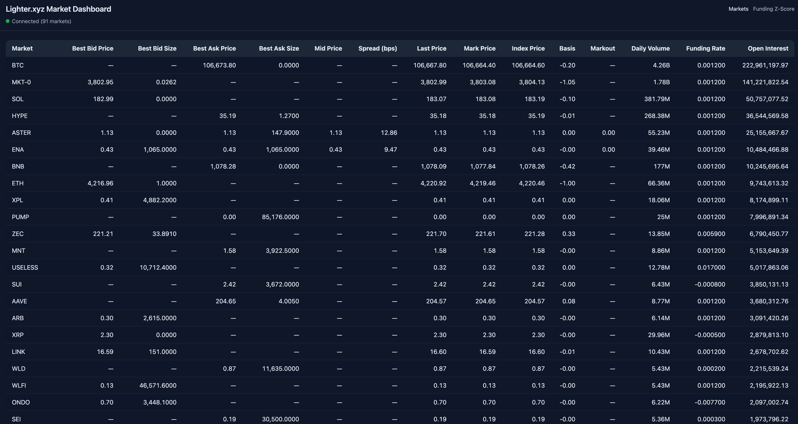
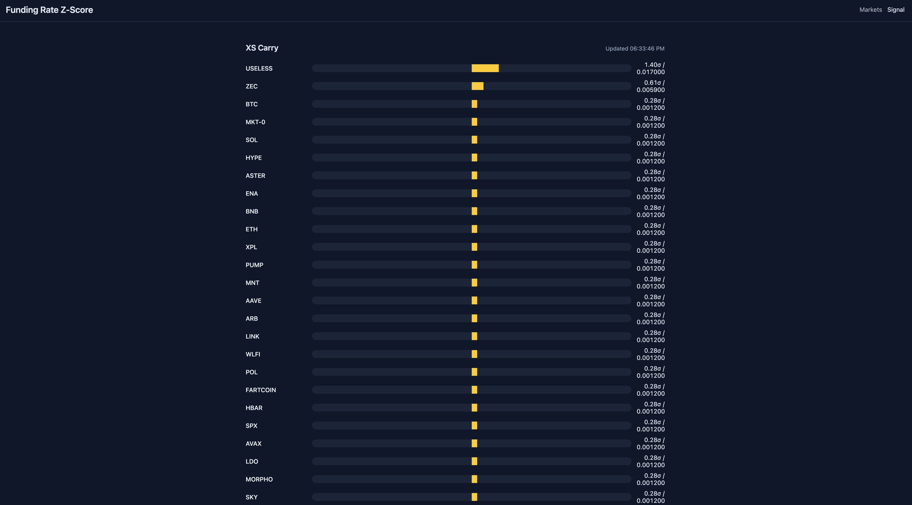

# lighter-md

Lighter.xyz market data streamer and real-time dashboard.

## Features

- Discovers every open market via `market_stats/all`, keeps a resilient single WebSocket connection, and automatically subscribes to per-market order books.
- Normalises websocket payloads with Pydantic, maintains an in-memory store with debounced fan-out updates, and serves them over a FastAPI WebSocket endpoint.
- Ships a minimal live dashboard (vanilla JS) that renders the full market table with mid price, basis, spread (bps), and markout columns, sorted by open interest, and patches rows in-place at up to 5 Hz per market.
- Provides a dedicated funding analytics page that computes cross-sectional funding-rate z-scores each minute and visualises them as a horizontal bar chart.

## Quickstart

```bash
uv venv --python 3.11
uv sync
uv run lighter-md          # start the FastAPI app (http://localhost:8000)
# open http://localhost:8000/funding for the funding z-score view
```

Run the test suite:

```bash
uv run pytest -q
```

## Architecture Overview

Component | Responsibility
--------- | ---------------
`lighter_md.ws_manager` | Manages discovery, subscriptions, and reconnection/backoff.
`lighter_md.store` | In-memory canonical state, top-of-book computation, diff emission.
`lighter_md.bus` | Lightweight in-process pub/sub fan-out for UI consumers.
`lighter_md.dashboard` | FastAPI app, HTTP routes, and the WebSocket endpoint for browsers.
`lighter_md/static/app.js` | Browser client that maintains a sorted table and applies partial updates.

## Screenshot




> Pair with `scripts/dev.sh` or `uv run lighter-md` for local development.
